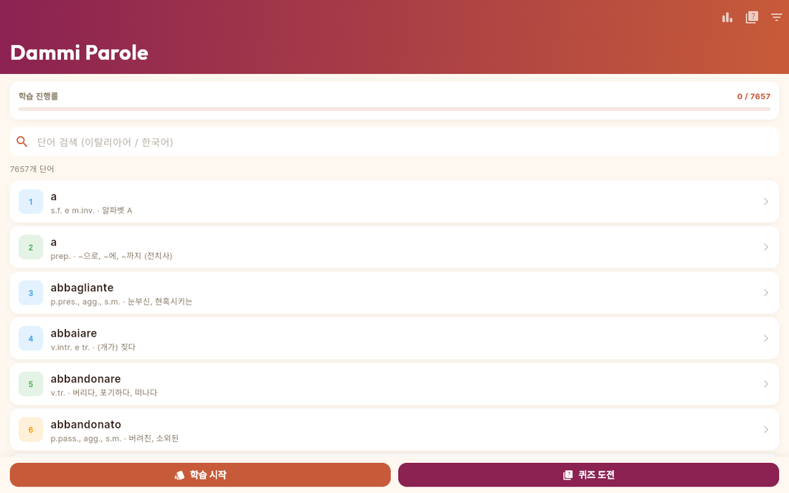
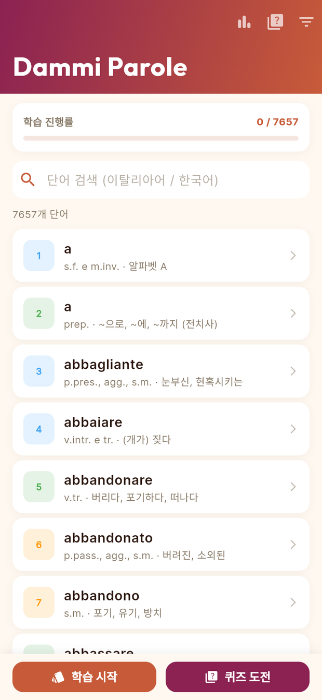
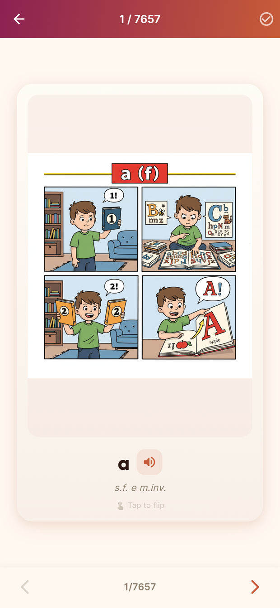
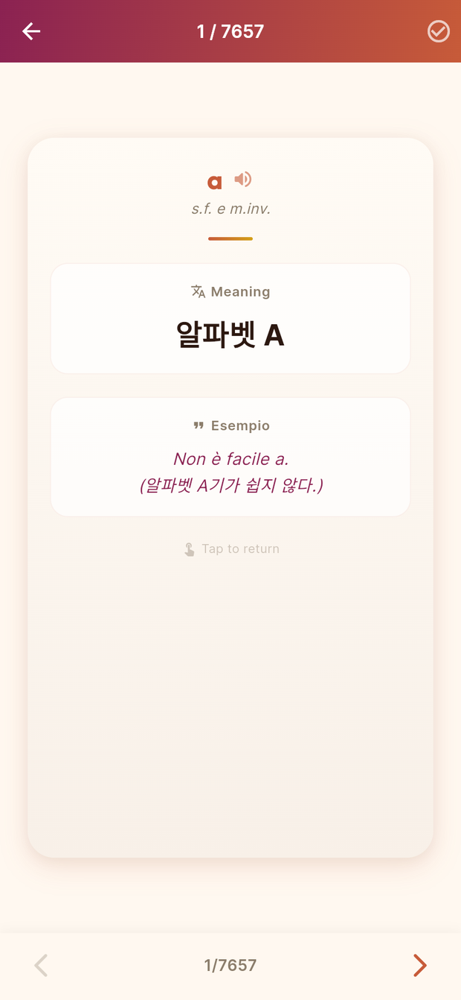
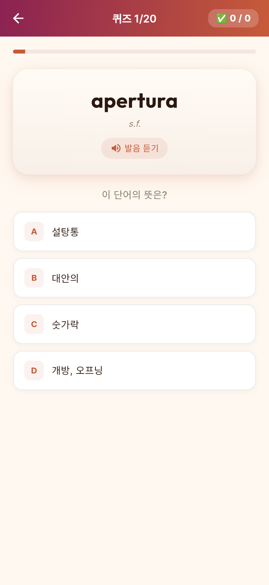
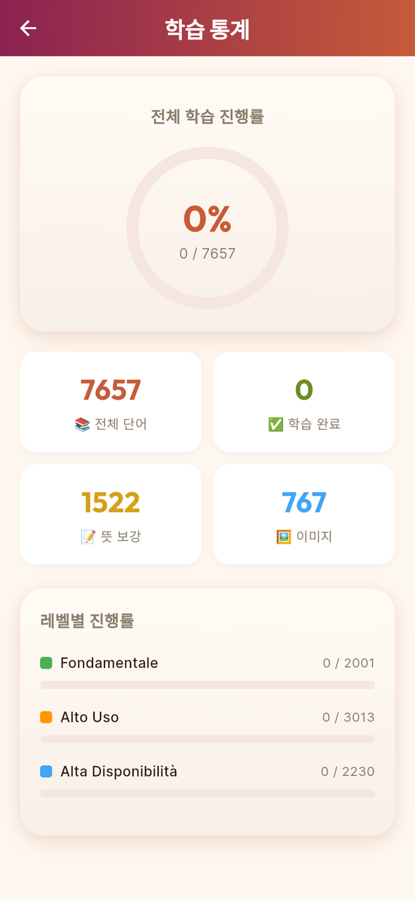
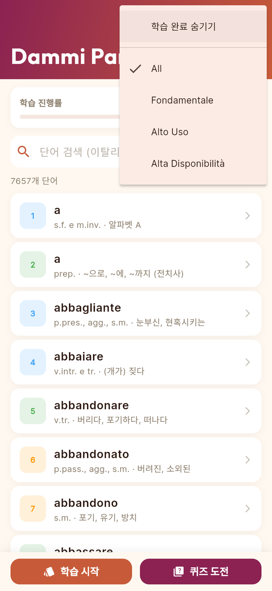

<div align="center">


# Dammi Parole

**이탈리아어 어휘를 4컷 만화로 익히는 플래시카드 학습 앱**
<br/>
<sub>A Flutter Web app for learning Italian vocabulary through 4-panel comic flashcards</sub>

<br/>

[](https://flutter.dev)
[](https://dart.dev)
[](https://m3.material.io)
[](https://web.dev/progressive-web-apps/)
[](LICENSE)
[](https://github.com/titoliviomilazzo/ItalianVocabApp/actions/workflows/flutter_web_deploy.yml)

### ▶ [**라이브 데모 열기 (Live Demo)**](https://titoliviomilazzo.github.io/ItalianVocabApp/)

<br/>



</div>

---

## ✨ 한눈에 보기

**Dammi Parole**(이탈리아어로 _"단어를 알려줘"_)는 이탈리아어 기초 어휘 **7,657개**를 플래시카드·퀴즈·발음으로 익히는 웹 앱입니다.
각 단어는 **4컷 만화**로 뜻을 시각화해, 글자만 외우는 단어장과 다르게 장면으로 기억에 남습니다.

설치가 필요 없는 **Flutter Web PWA**라 PC·모바일 브라우저에서 바로 열리고, 홈 화면에 추가하면 앱처럼 동작합니다.

> 이 저장소는 학생들에게 보여줄 **AI 협업 개발 예시**로 정리되어 있습니다. 설계·코드·이미지·데이터가 어떻게 만들어졌는지는 아래 [이렇게 만들었습니다](#-이렇게-만들었습니다)와 [`docs/`](docs/)를 참고하세요.

---

## 📱 스크린샷

<table>
  <tr>
    <td align="center"><br/><sub><b>홈 · 단어 목록</b><br/>검색 · 진행률 · 레벨 배지</sub></td>
    <td align="center"><br/><sub><b>플래시카드 앞면</b><br/>4컷 만화로 보는 단어</sub></td>
    <td align="center"><br/><sub><b>플래시카드 뒷면</b><br/>뜻 · 예문 · 발음</sub></td>
  </tr>
  <tr>
    <td align="center"><br/><sub><b>퀴즈 모드</b><br/>4지선다 20문제</sub></td>
    <td align="center"><br/><sub><b>학습 통계</b><br/>레벨별 진행 대시보드</sub></td>
    <td align="center"><br/><sub><b>난이도 필터</b><br/>레벨별 골라 학습</sub></td>
  </tr>
</table>

---

## 🎯 주요 기능

| | 기능 | 설명 |
|:--:|---|---|
| 🃏 | **4컷 만화 플래시카드** | 단어를 4컷 만화로 시각화. 탭하면 3D 플립으로 뒷면(뜻·예문)이 뒤집힙니다. |
| 🔀 | **학습 모드 선택** | `순서대로 학습`과 `랜덤 셔플` 중 선택. |
| 📝 | **퀴즈 모드** | 20문제 4지선다 세션. 점수와 결과를 표시. |
| 🔊 | **원어민 발음(TTS)** | Web Speech API로 이탈리아어(`it-IT`) 발음을 재생. |
| 🔎 | **단어 검색** | 이탈리아어·한국어 양방향 검색. |
| 📊 | **학습 통계** | 전체·레벨별 진행률, 학습 완료 수를 대시보드로. |
| 🎚 | **난이도 필터** | `Fondamentale` · `Alto Uso` · `Alta Disponibilità` 레벨별 필터링. |
| ✅ | **학습 완료 표시 · 진도 저장** | 단어별 완료 체크. 진도는 브라우저 `localStorage`에 저장. |

---

## 🧩 데이터

출처는 이탈리아어 빈도 어휘 사전 **_Nuovo Vocabolario di Base della lingua italiana_** 입니다.

| 항목 | 수치 |
|---|--:|
| 전체 단어 | **7,657** |
| 한국어 뜻 보강 완료 | 1,522 |
| 4컷 만화 삽화 보유 | 767 |

**레벨 구성**

| 레벨 | 단어 수 | 의미 |
|---|--:|---|
| 🟢 `Fondamentale` | 2,001 | 가장 기본적인 핵심 어휘 |
| 🟠 `Alto Uso` | 3,013 | 사용 빈도가 높은 어휘 |
| 🔵 `Alta Disponibilità` | 2,230 | 일상에서 쉽게 떠올리는 어휘 |

각 단어 데이터는 `id`, `word`, `gender`, `level`, `meaning`(한국어), `pronunciation`, `example`(예문), `story`(만화 스토리), `image_path` 필드로 구성됩니다. → [`assets/data/vocab.json`](assets/data/vocab.json)

---

## 🛠 기술 스택

- **Framework** — Flutter `3.38.9` (Web), Dart `^3.10.8`, Material 3
- **Fonts** — Google Fonts (`Outfit` 디스플레이 · `Inter` 본문)
- **TTS** — Web Speech API (`package:web` + `dart:js_interop`)
- **상태/저장** — 로컬 JSON 로딩 + 브라우저 `localStorage`
- **CI/CD** — GitHub Actions → GitHub Pages 자동 배포
- **디자인** — 이탈리아풍 팔레트 (terracotta `#C75B39` · olive `#6B8E23` · golden amber `#D4A017` · warm cream `#FFF8F0`)

---

## 🤖 이렇게 만들었습니다

이 앱은 **사람과 여러 AI 도구의 협업**으로 만들어졌습니다. 코드를 한 줄씩 직접 친 게 아니라, 단계마다 알맞은 도구에 일을 맡기고 사람이 방향을 잡았습니다.

| 단계 | 도구 | 한 일 |
|---|---|---|
| 🧱 설계·초기 구현 | **Google Antigravity (Gemini)** | 프로젝트 골격, 데이터 모델, 기본 UI, 1차 데이터 보강 |
| 🎨 이미지 생성 | **Genspark Pro** | 단어별 4컷 만화(2×2 패널) 일러스트 생성 |
| 🐍 데이터 가공 | **Python 스크립트** | 프롬프트 자동 생성, CSV→JSON 변환, 뜻·예문 보강 ([`archive/scripts/`](archive/scripts/)) |
| 🔧 리팩토링·배포 | **Claude Code** | 버그 수정, 웹 이미지 로딩 안정화, GitHub Pages 배포, 문서 정리 |

제작 과정의 원본 기록은 [`docs/`](docs/)에, 프롬프트·스크립트 등 작업 산출물은 [`archive/`](archive/)에 보존했습니다.

- 📘 [`docs/DEVPLAN.md`](docs/DEVPLAN.md) — 개발 마스터 플랜
- 🏛 [`docs/ARCHITECTURE.md`](docs/ARCHITECTURE.md) — 구조·기능 상세
- 🕘 [`docs/HISTORY.md`](docs/HISTORY.md) — 개발 히스토리
- 📝 [`CHANGELOG.md`](CHANGELOG.md) — 변경 이력

---

## 📂 프로젝트 구조

```
ItalianVocabApp/
├── lib/
│   ├── main.dart                      # 앱 진입점, 데이터 로딩
│   ├── models/word.dart               # 단어 데이터 모델
│   ├── screens/                       # 홈 · 플래시카드 · 퀴즈 · 통계 화면
│   ├── widgets/flashcard_widget.dart  # 3D 플립 카드 위젯
│   ├── services/                      # TTS · 저장 · 이미지 로딩
│   └── theme/app_theme.dart           # 이탈리아풍 디자인 시스템
├── assets/
│   ├── data/vocab.json                # 7,657 단어 데이터
│   └── images/                        # 4컷 만화 일러스트
├── web/                               # PWA 매니페스트 · 아이콘
├── test/                              # 데이터 무결성 · 위젯 테스트
├── docs/                              # 개발 문서 · 스크린샷 · 브랜딩
├── archive/                           # 제작 과정 산출물(프롬프트·스크립트·원본 데이터)
└── .github/workflows/                 # GitHub Pages 자동 배포
```

---

## 🚀 로컬 실행 & 배포

```bash
# 의존성 설치
flutter pub get

# 크롬에서 실행
flutter run -d chrome

# 웹 빌드 (GitHub Pages용 base-href)
flutter build web --base-href "/ItalianVocabApp/" --release
```

`main` 브랜치에 푸시하면 **GitHub Actions**가 자동으로 웹 빌드 후 **GitHub Pages**에 배포합니다. → [`.github/workflows/flutter_web_deploy.yml`](.github/workflows/flutter_web_deploy.yml)

---

## 👤 만든 사람 & 라이선스

**Marcus** ([@titoliviomilazzo](https://github.com/titoliviomilazzo))가 개인 학습용으로 만든 프로젝트이며, 수업에서 **AI 협업 개발 사례**로 소개하기 위해 정리했습니다.

코드·이미지·데이터의 라이선스는 [`LICENSE`](LICENSE)(MIT)를 따릅니다. 단어 데이터의 원천은 _Nuovo Vocabolario di Base della lingua italiana_ 입니다.

<div align="center">
<br/>
<sub>Made with Flutter · Gemini · Genspark · Claude · Python</sub>
</div>
